# System Architecture

This document describes the platform's architectural principles, module inventory, data architecture, and technology stack. It is the canonical reference for *how* the system is built; *what* must be built per version is specified in [`requirements.md`](requirements.md), and *when* in [`roadmap.md`](roadmap.md).

---

## Architectural Principles

### 1. Two architecture generations, one non-breaking evolution

```mermaid
flowchart LR
    subgraph V1["V1 Architecture Line (Foundation → v3.0)"]
        F[Foundation: Infra Baseline] --> A[v1.0 Conversational Core]
        A --> B[v1.1 Voice Pipeline]
        B --> C[v1.2 Multi-Agent + Plugins]
        C --> D[v2.0 Computer Control + Security]
        D --> E[v2.1 Emotion + Automation]
        E --> G[v3.0 Memory Maturity — V1 GA]
    end
    subgraph V2["V2 Architecture Line (v3.1 → v5.1)"]
        H[v3.1 AI-OS Core] --> I[v4.0 Skills + Workspace]
        I --> J[v4.1 Personality Engine]
        J --> K[v5.0 Learning + Collaboration + Daily Assistant]
        K --> L[v5.1 Governance Layer]
    end
    G -->|wrapped by, non-breaking| H
    L --> M[Commercial GA]
    M --> N[Enterprise Edition]
```

The **V1 Architecture Line** builds a complete, independent product: conversation, voice, multi-agent orchestration, computer control, security, emotion/automation, and memory. It concludes at **v3.0 (V1 GA)**.

The **V2 Architecture Line** does not replace V1. Starting at **v3.1 (AI-OS Core)**, a central kernel layer — Capability Registry, Context Manager, and Governance Router — wraps V1's existing Orchestrator as a "planning module" inside a new Central Dispatch. Every subsequent capability (skills, workspaces, personality, long-term learning, collaboration, governance) is registered through this kernel rather than hardcoded into the core, allowing capability growth without core-code changes.

### 2. Every capability is dispatched through a single governed path

From v3.1 onward, **no dispatch path may bypass the Governance Router**. This is enforced structurally: the Central Dispatch is the only entry point through which agents, skills, and plugins are invoked, and the Governance Router performs a synchronous permission + policy check on every call. The v5.1 Policy Engine and Compliance Module integrate into this same router rather than creating a parallel enforcement path.

### 3. Execution is isolated from planning

The **Execution Broker** (introduced in v2.0) is a fully separate process from the agent/orchestration processes. No agent process is ever granted direct root/admin access — all system-level actions (file operations, app interaction) pass through the broker, which supports dry-run previews and rollback via execution snapshots.

### 4. Security and privacy are enforced per-layer, not just at the edge

- **Permission Engine v1** (coarse-grained, v1.0) evolves into **Permission Engine v2** (RBAC + ABAC, risk-scored, v2.0).
- **Audit logs are append-only/immutable** from the first version that introduces them (v1.0) onward.
- **Per-user and per-workspace data isolation** is a testable requirement at every layer that stores user data (memory, voice, emotion, workspaces, cross-workspace pattern mining).
- **Right-to-forget** is implemented incrementally as each memory type is introduced (semantic in v1.0, episodic/procedural in v3.0) and must remain fully functional as new memory types are added.

### 5. Personality and automation never override safety

The Personality Engine's Consistency Guard middleware (v4.1) and the Automation Engine (v2.1) are both explicitly required to pass through the full permission/governance chain — persona configuration or automation rules can never be used to bypass safety, honesty, or permission enforcement.

---

## Module Inventory

Modules are listed in the version that introduces them. This is the canonical map of "what service does what, and since when."

| Module / Service | Introduced In | Responsibility |
|---|---|---|
| CI/CD Pipeline, K8s Dev Cluster, Event Bus baseline, Observability stack, Vault baseline | Foundation | Infrastructure baseline: build/test/deploy automation, secrets, logging/metrics |
| Auth & Identity Service | v1.0 | User/tenant authentication, JWT issuance and rotation |
| Conversational Agent Service | v1.0 | Single-LLM-backed chat, Redis working memory |
| Basic Permission Engine | v1.0 | Coarse-grained allow/deny tool-call gating, immutable audit log |
| Task Management Engine | v1.0 | Task queue + state machine |
| Tool SDK v1 (Web Search) | v1.0 | Manifest-based tool interface, first tool implementation |
| Wake-word / VAD / STT / TTS Services | v1.1 | Voice capture, transcription, and speech synthesis |
| Voice Streaming Gateway | v1.1 | Bidirectional real-time audio streaming (WebRTC/WebSocket) |
| Orchestrator Service | v1.2 | Intent → task-plan (DAG) compilation, routing |
| Coder Agent, Researcher Agent | v1.2 | Specialist task-execution agents |
| Plugin Runtime (sandboxed) | v1.2 | Manifest-based, sandboxed (WASM/gVisor) tool/plugin execution |
| Agent Capability Registry (v1 basic) | v1.2 | Agent capability discovery |
| Computer-Control Service | v2.0 | OS-native accessibility API integration, L1–L3 action levels |
| Execution Broker | v2.0 | Isolated, sandboxed execution of system-level actions, rollback support |
| Permission Engine v2 (RBAC + ABAC) | v2.0 | Granular, risk-scored, attribute-based permission enforcement |
| Guardian Agent | v2.0 | Policy enforcement, anomaly detection |
| Anomaly Detection Service | v2.0 | Behavioral anomaly scoring |
| Emotion Detection Service | v2.1 | Multi-modal (voice + text) sentiment/valence-arousal detection |
| Automation Rule Engine + Compiler | v2.1 | Trigger→Condition→Action rule execution, conversational rule authoring |
| Memory Consolidation Job | v3.0 | Periodic episodic/procedural memory consolidation |
| Episodic/Procedural Memory Store | v3.0 | Long-term experience and skill-execution memory |
| Feedback Capture Service | v3.0 | Implicit + explicit feedback ingestion |
| Preference Model Service | v3.0 | Static preference-vector personalization |
| **AI-OS Core** (Capability Registry, Context Manager, Governance Router, Central Dispatch) | v3.1 | Central kernel: capability discovery, context tracking, unified governance |
| Skill Registry + Executor | v4.0 | Reusable skill manifest storage and execution |
| Skill Authoring Tool | v4.0 | Conversational skill-teaching |
| Project Workspace Service | v4.0 | Long-lived, memory-scoped project containers |
| Personality Engine (selector, adaptive layer, consistency guard) | v4.1 | Tone configuration and consistency enforcement across all output paths |
| Longterm Pattern Mining Service | v5.0 | Cross-workspace pattern detection (privacy-preserving) |
| Collaboration Engine (negotiation protocol) | v5.0 | Structured agent-to-agent negotiation (peer review, debate/consensus) |
| Conflict Resolution Agent | v5.0 | Resolves multi-agent disagreement or escalates to human |
| Daily Assistant Service | v5.0 | Briefings, contextual nudges, routine detection |
| Policy Engine | v5.1 | Org-level rule definition and enforcement |
| Compliance Module | v5.1 | Data residency and retention policy |
| Explainability Service | v5.1 | Human-readable decision rationale generation |
| Audit Council Workflow Service | v5.1 | Formal human-review escalation workflow |
| Cost Governance Service | v5.1 | Quota and budget-alert enforcement |
| Billing Service | Commercial GA | Usage-based metering and subscription billing |
| Marketplace Revenue-share Engine | Commercial GA | Plugin/skill marketplace monetization |
| Multi-region Deployment Infra | Commercial GA | Data-residency-compliant multi-region hosting |
| Enterprise Deployment Package (Helm/Terraform) | Enterprise Edition | Self-hosted/on-prem/air-gapped deployment |
| SSO Integration Service | Enterprise Edition | SAML/OIDC enterprise IdP connectivity |
| Policy Pack Loader | Enterprise Edition | Industry-specific compliance bundle installation |
| Dedicated Governance Instance Provisioning | Enterprise Edition | Per-tenant dedicated governance-as-a-service |

---

## Data Architecture

### Relational Tables (by introducing version)

| Version | Tables Introduced |
|---|---|
| Foundation | *(schema + migration tooling only, no business tables)* |
| v1.0 | `users`, `tenants`, `sessions`, `tasks`, `permissions`, `permission_audit_log`, `memory_semantic` |
| v1.1 | `voice_sessions`; extends `sessions` with `input_modality` |
| v1.2 | `agents_registry`, `plugins_registry`, `installed_plugins` |
| v2.0 | `execution_snapshots`, `anomaly_detection_log`; extends `permissions` with `risk_level`, ABAC attribute columns |
| v2.1 | `automation_rules`, `automation_execution_log`; extends `memory_semantic` with `emotion_tag` |
| v3.0 | `feedback_events` |
| v3.1 | `capability_registry` |
| v4.0 | `skills_registry`, `installed_skills`, `skill_execution_log`, `workspaces` |
| v4.1 | `personality_profiles` |
| v5.0 | `agent_negotiation_log`, `daily_briefing_log`; extends `agents_registry` with continuous `trust_score` recalculation |
| v5.1 | `governance_policies`, `compliance_audit_log` |
| Commercial GA | `billing_usage`; extends `plugins_registry`/`skills_registry` with pricing/revenue-share columns |
| Enterprise Edition | `policy_pack_installations`; extends `tenants` with `deployment_mode`, `sso_config` |

### Vector Collections (Qdrant)

| Collection | Introduced In | Purpose |
|---|---|---|
| `semantic_memory` | v1.0 | User fact/preference retrieval (RAG) |
| `episodic_memory`, `procedural_memory` | v3.0 | Long-term experience and skill-execution memory |
| `capability_embeddings` | v3.1 | Semantic capability matching (ANN index) |
| `skill_embeddings` | v4.0 | Trigger-phrase → skill semantic matching |

### Event Bus Topics (by introducing version)

| Version | Topics |
|---|---|
| v1.0 | `task.created`/`updated`/`completed`, `permission.requested`/`granted`/`denied` |
| v1.2 | Agent routing/dispatch events |
| v3.1 | `ai_os.capability.registered`, `ai_os.dispatch.decided` |
| v4.0 | `workspace.created`/`updated`/`archived`, `skill.invoked`/`completed`/`refined` |
| v5.0 | `agent.negotiation.proposed`/`resolved`, `daily_assistant.briefing.generated` |

### API Surface Overview

The full endpoint-by-endpoint specification lives in [`requirements.md`](requirements.md). At a high level, the API is versioned in two namespaces:

- **`/v1/*`** — introduced across the V1 Architecture Line (auth, conversations, tasks, permissions, voice, plugins, computer-control, security, automations, memory, billing).
- **`/v2/*`** — introduced from the AI-OS Core onward (capabilities, context, skills, workspaces, personality, collaboration, daily-assistant, governance, enterprise).

---

## Technology Stack

| Layer | Technology | Notes |
|---|---|---|
| Backend services | FastAPI / Go | Stateless, containerized, one service per bounded module |
| Relational database | PostgreSQL | Migrations via Alembic/Flyway; no direct schema edits |
| Session / working memory | Redis | Session-scoped conversational context |
| Vector store | Qdrant | Semantic, episodic, procedural memory; capability/skill embeddings |
| Event bus | NATS / Kafka | Publish/subscribe for cross-service coordination |
| Container orchestration | Kubernetes + Helm | Per-service Helm charts; rolling deploys |
| Observability | OpenTelemetry, Prometheus, Grafana, Loki | Tracing, metrics, dashboards, structured logs |
| Secrets management | HashiCorp Vault | Least-privilege access policies; no hardcoded secrets |
| LLM provider | Anthropic Claude API | Primary and default LLM across all agents |
| Plugin sandboxing | WASM / gVisor | Isolated, resource-limited third-party code execution |
| Internal service communication | gRPC (from v1.2) | Agent ↔ Orchestrator and inter-service calls |
| Voice transport | WebRTC / WebSocket, Opus/PCM | Streaming audio in/out |
| Voice/security transport encryption | DTLS-SRTP / WSS | Voice stream encryption |

---

## Global Architectural Rules

These rules apply across every version and are treated as release-gate security requirements (see [`requirements.md`](requirements.md) for the per-version checklist items that verify them):

1. No secret is ever hardcoded or stored in plaintext; CI enforces secret-scanning.
2. All internal service-to-service communication is encrypted (mTLS internally; DTLS-SRTP/WSS for voice).
3. Every permission-relevant action is recorded in an append-only, immutable audit log.
4. Least-privilege access is enforced at every layer (Vault policies, RBAC/ABAC, sandbox resource limits).
5. The Execution Broker and any process capable of system-level action is isolated from the core agent/orchestration processes.
6. From v3.1 onward, the Governance Router is the single mandatory checkpoint for all capability dispatch — no path may bypass it.
7. LLM context never receives raw secrets directly; all sensitive values pass through a tool-broker layer.
8. Persona configuration (v4.1) and automation rules (v2.1) can never override safety, honesty, or permission enforcement.
9. Per-user and per-workspace data isolation is a testable requirement wherever user data is stored (memory, voice, emotion, workspace, cross-workspace mining).
10. Right-to-forget must remain fully functional as new memory types are introduced.